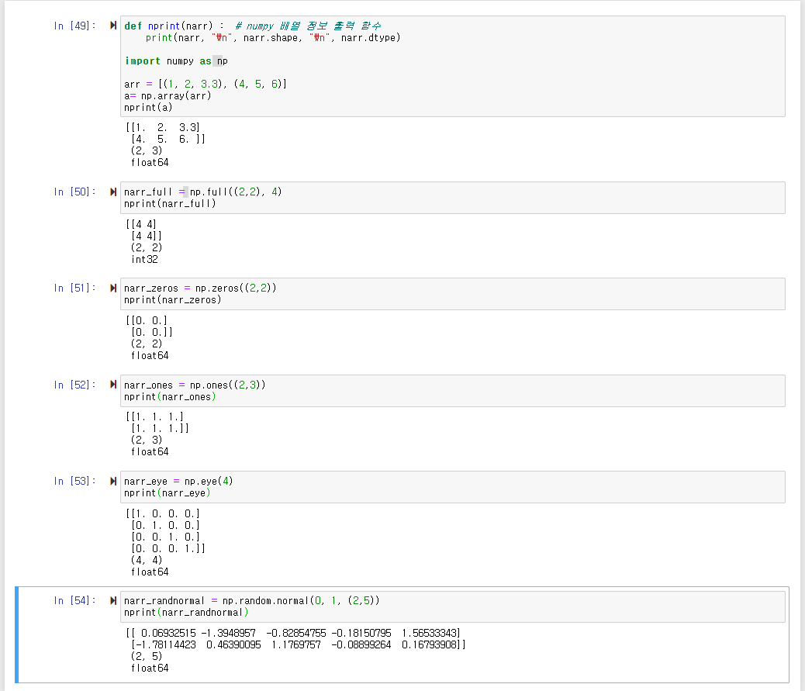

# Numpy ?
  Numerical Python의 약자로, 파이썬의 행렬 데이터 연산을 위한 라이브러리이다.
  파이썬에서 데이터 분석이나 머신러닝에서 주로 행렬 데이터를 전처리하는 데 많이 사용된다.  
  파이썬의 기본 자료형인 list보다 빠르다고 알려져있다. 또한 서로다른 모양의 행렬 연산이 가능한 브로드캐스팅(Broadcasting)이 가능하여 편리하다.


## nprint 함수 정의
결과를 보기 좋게 출력하기 위한 함수 정의
```python
def nprint(narr) :  # numpy 배열 정보 출력 함수
    print(narr, "\n", narr.shape, "\n", narr.dtype)
```

## np.array
``` python
import numpy as np // numpy 라이브러리를 import
    
arr1 = [(1, 2, 3), (4, 5, 6)]
narr1 = np.array(arr1) //
print(arr, "\n", a.shape, "\n", a.dtype)
```
`numpy.array(object, dtype=None, copy=True, order='K', subok=False, ndmin=0)`  
 np.array에 list형 객체를 넘겨주어 배열을 생성한다.


## np.full
```python
narr_full = np.full((2,2), 4)
nprint(narr_full)
```
`numpy.full(shape, fill_value, dtype=None, order='C')`  
 shpae는 파이썬의 tuple 자료형으로 넣어주어야 한다. 즉, 괄호로 감싼 형태여야 한다.


## np.zeros
```python
narr_zeros = np.zeros((2,2))
nprint(narr_zeros)
```
`numpy.zeros(shape, dtype=float, order='C')`  
 zeros 함수는 0으로 채운 행렬을 반환한다.

## np.ones
```python
narr_ones = np.ones((2,3))
nprint(narr_ones)
```
`numpy.ones(shape, dtype=None, order='C')`  
np.ones는 1로 채운 배열을 반환한다.


## np.eye
```python
narr_eye = np.eye(4)
nprint(narr_eye)
```
`numpy.eye(N, M=None, k=0, dtype=<class 'float'>, order='C')`  
np.eye는 단위 행렬을 반환한다.

## np.random.normal
```python
narr_randnormal = np.random.normal(0, 1, (2,5))
nprint(narr_randnormal)
```
`numpy.random.normal(loc=0.0, scale=1.0, size=None)`  
정규분포를 따르는 난수를 생성해준다. 여기서 `loc`은 평균이며, `scale`은 표준편차이다. `size`는 출력할 데이터의 shape를 지정한다. 입력하지 않으면 1개의 값을 리턴한다.

``` python
np.random.normal(0, 1, (100, 2)) # 평균은 0 표준편차는 1을 따르는 100개의 2차원 배열 생성
```


``` python
np.random.normal(10, 3, (100, 3, 4)) # 평균이 10이고 표준편차는 3인 shape = (100 * 3 * 4) 의 데이터 생성
```


## np.random.rand
균등분포를 갖는 난수를 생성한다.
``` python
np.random.uniform(10, 30, (100,2))
```


# 코드 실행 결과



## numpy.concatenate((a1,a2, ...), axis = 0, out=None)
``` python
a1 = np.array([[1, 2], [3, 4], [5, 6]])
a2 = np.array([[7, 8], [9,10], [11,12]])
print(np.concatenate((a1,a2), axis = 0))
print(np.concatenate((a1,a2), axis = 1))
print(np.concatenate((a1,a2), axis = None))
```


 추후 계속 업데이트 예정..