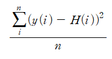
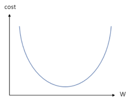
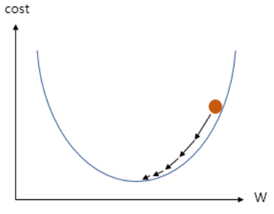
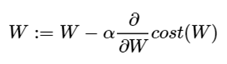

# 1.1. 선형 회귀 (Linear Regression)  

노동 시간과 수입, 공사기간과 공사비용 등 실생활에서 많은 경우가 독립변수(노동시간, 공사기간)가 증가하면 그에 비례해서 종속변수(수입, 공사비용..)가 증가하는 경우가 많다. 이러한 경우 선형 회귀를 사용하면, 어떤 임의의 독립변수를 주었을 때 그에 맞는 예측 값을 구할 수 있다.

## 1.1.1. 가설 (Hypothesis) 설정
여기서 두 변수의 관계는 직선형이므로(기울기와 절편은 아직 알 수 없지만), y = ax + b를 따른다고 가정할 수 있다. 그런데 보통 머신러닝 등에서 학습 대상인 가중치는 W로 많이 표현하고, 예측값은 Hypotehsis의 H로 사용하여, ‘H = Wx + b’ 형태로 많이 쓴다. 선형 회귀에서는 직선의 기울기(W)와 절편(b)가 학습 대상인 것이다.

## 1.1.2. 손실/비용/목적 함수 (Loss/ Cost/ Objective function)
현재의 회귀 모델(직선, H)이 얼마나 데이터를 잘 예측하는지, 계산할 필요가 있다. 그러므로 이를 측정하기 위해서 모델에 대한 손실(비용)함수를 설정하는데, 선형 회귀에서는 n개의 데이터의 실제 정답값(Y)와 회귀 식이 예측한 값(H)의 차이를 구하기 위해서, 각 정답과 예측값의 차이를 제곱한 것의 평균을 비용함수로 설정할 수 있다. 즉,  

  

와 같이 나타낼 수 있다. 이를 MSE(Mean Squared Error)라고 하고, 저 비용함수의 값이 작아지도록 하는 것이 목적이다.

## 1.1.3. Optimizer (최적화 알고리즘, 학습 방법)
이제 Cost함수를 최소화할 방법을 생각해 보아야한다. Cost함수는 y값은 고정된 값(상수)이고, H값이 x축이다. H값은 W와 b의 함수이므로, x축은 W를 갖는 아래로 볼록한 이차함수(b는 일단 고려하지 않음)라고 할 수 있다.

  
Cost함수  

 

만약 위처럼 W가 주황색 점 지점에 있다고하면, cost함수를 W에 대하여 미분하였을 때 접선의 기울기는 양수가 될 것이다. 반대로 최저점의 왼쪽에 있다면 음수가 될 것이다. 만약 접선이 양수를 갖는다면, W는 현재보다 왼쪽으로 이동해야 최저점으로 향할 수 있을 것이다. 즉, 접선의 기울기가 양수이면 왼쪽으로, 음수이면, 오른쪽 방향으로 이동해야한다. 이를 이용해서 점차 W의 값을 조정해가는 것이다. 다시 정리하면 W는 다음과 같은 수식으로 학습한다. 

 

이러한 방법을 Gradient Descent(경사하강) 방법이라고 한다. 이 과정은 b에 대해서도 동일하게 적용된다. 이 과정을 여러번 거치면 데이터에 맞게 학습된 W와 b를 갖는 직선을 갖게 될 것이다.
 