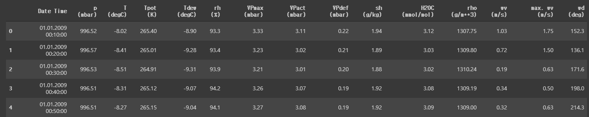
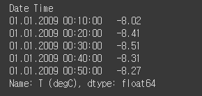
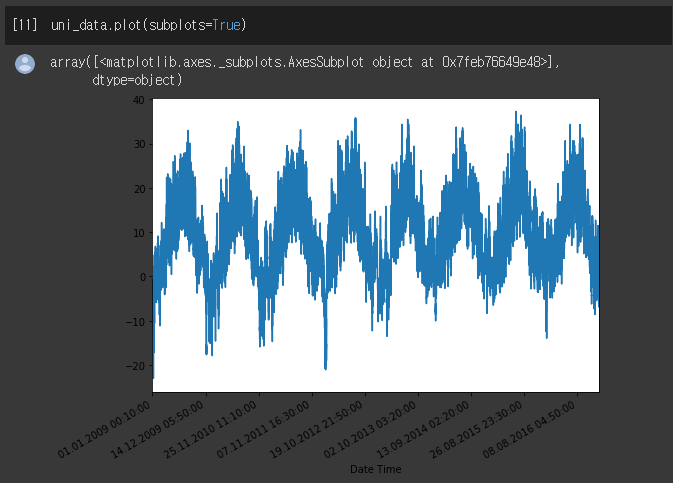
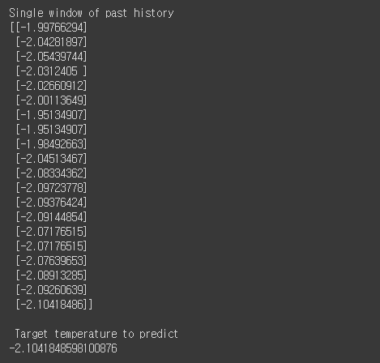
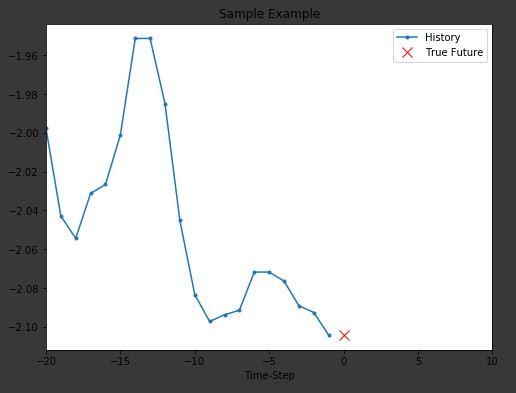
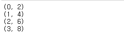

# RNN in Keras

## Outputs and states
 기본적으로, RNN 층은 한 샘플당 하나의 벡터를 출력한다. 이 벡터는 이전 timestep에 대한 출력이고, 전체 순서에 대한 정보를 담고있다.

  그리고 Keras에서 RNN layer는 최종 state를 출력할 수 있다고 하는데, 아직 구체적으로 어떻게 사용되는지는 잘 모르겠다. 다른 RNN을 초기화하거나, 추후에 다시 사용할 때 사용하는 것 같다. model을 저장하는 것과 비슷한 듯하다. 아무튼, state를 리턴하게 하려면 Layer를 생성할 때 `retrun_state`를 Ture로 지정해줘야한다. 참고로 LSTM은 2개의 state 텐서, GRU는 1개의 state 텐서를 갖는다.


## RNN layers and RNN cells
 RNN API는 layer가 아닌 cell에 대한 API도 제공한다.  
 생략.. [참고](https://www.tensorflow.org/guide/keras/rnn#rnn_layers_and_rnn_cells)


## Biderectional model
 다음 단어를 예측할 때, 이전에 온 단어들만 보는 것보다 그 주변의 문맥을 보는 것이 더 정확할 것이라는 것에서 아이디어를 얻은 model임.

 이 모델에서는 RNN layer를 복사하고, 뒤집어, input에 대해 반대순서로  연산을 진행한다.
 
 기본적으로 Bidirectional RNN의 출력은 forward 출려과 backword 출력의 합이다. 합하는 연산은 `merge_mode` parameter를 변경하여 바꿀 수 있다.


# Time series forecasing
## Dataset
  이 예제에서는 기온, 기압, 습도 등 14개의 특성값을 포함한 다음과 같은 날씨 시계열 데이터 셋을 사용한다. 

  ``` python
df = pd.read_csv(csv_path)
df.head()
```
  

 이 데이터를 이용해 이전 `5일 간의 데이터를 입력했을 때, 앞으로 6시간 이후의 기온을 예측`해보려고 한다(6시간 동안의 기온이 아님). 데이터가 10분단위로 수집되었으므로, 5일이면 6*24*5 = 720개의 데이터가 입력되야하고, 6*6 = 36개(6시간)의 데이터를 출력한다.
  이 데이터의 14개의 특성값을 모두 이용해서 예측하기 전에, 기온(1개 특성)만 이용해서 예측해보자. 더 간소화해서, 이 20개 timestep(약 3시간)의 기온을 학습해서, 바로 다음 time step의 기온을 예측해보자.

 아래 코드는 간소화된 예시를 위한 특성데이터와 label데이터를 분리하는 함수이다.

 ``` python
 def univariate_data(dataset, start_index, end_index, history_size, target_size):
  data = []
  labels = []

  start_index = start_index + history_size
   #start index는 데이터셋에서 뽑아내기 시작하는 시작 index.
   # history_size는 학습할 이전 데이터의 길이를 말함.
  if end_index is None:
    end_index = len(dataset) - target_size  # None이면 끝까지
    # end index는 시작 index의 마지막을 의미함.
    # start index ~ end index의 데이터를 사용하는 것이 아니라
    # i가 start ~ end까지 변하고, (i - history size) ~ i만큼은 data(입력데이터)가 되는 것이고, i ~ (i + target_size) 만큼은 label(정답)데이터가 됨.
    # tartget size는 36(6시간) 입력 될 것
    

 # 시계열 데이터 학습은 같은 열의 데이터에 학습data과 정답label이 모두 존재하는 꼴임에 주의.

  for i in range(start_index, end_index):
    indices = range(i-history_size, i)
    # Reshape data from (history_size,) to (history_size, 1)
    data.append(np.reshape(dataset[indices], (history_size, 1))) # 참고 : 넘파이 배열에 인덱스로 리스트를 전달하면, 리스트가 가리키는 인덱스 모두 반환.
    # append는 리스트의 메소드임. numpy 메소드 아님.
    labels.append(dataset[i+target_size]) # 단순히 target size 후의 데이터만 학습한다? 그 sequence 모두를 예측하는 것이 아님.
  return np.array(data), np.array(labels)
 ```


## Forecast a univariate time series
[Tensorflow 가이드 : Time series forecasting를 분석하여 작성하였음.](https://www.tensorflow.org/tutorials/structured_data/time_series)  
 먼저 이전의 기온데이터만을 이용해서 앞으로의 기온데이터를 예측해본다. 여기서는 이전의 20개의 데이터를 학습하고, 바로 다음 time step에서의 기온을 예측해본다.
그러기위해 먼저 dataframe에서 기온데이터만 추출하자.  

``` python
uni_data = df['T (degC']
uni_data.index = df['Date Time']
uni_data.head()
```




### Rescale
 Neural Network에 입력하기전에 값을 재조정하는 것이 중요하다. 그 중 하나의 방법은 값을 0에서 1로 변경하는 정규화(Standardization)이다. 

``` python
uni_train_mean = uni_data[:TRAIN_SPLIT].mean()
uni_train_std = uni_data[:TRAIN_SPLIT].std()
uni_data = (uni_data-uni_train_mean)/uni_train_std # 정규화 값 = (각 데이터 - 평균) / 표준 편차
```


``` python
univariate_past_history = 20 # 이전 20개의 데이터 학습
univariate_future_target = 0 # 1개 예측

# 처음부터 test데이터 까지
x_train_uni, y_train_uni = univariate_data(uni_data, 0, TRAIN_SPLIT,
                                           univariate_past_history,
                                           univariate_future_target)
# test데이터 이후부터, 끝까지
x_val_uni, y_val_uni = univariate_data(uni_data, TRAIN_SPLIT, None,
                                       univariate_past_history,
                                       univariate_future_target)
```


``` python
print ('Single window of past history')
print (x_train_uni[0])
print ('\n Target temperature to predict')
print (y_train_uni[0])
```




``` python
def create_time_steps(length): # time step 을 생성하는 메소드
  return list(range(-length, 0))
  # -length 에서 0 값을 갖는 리스트 반환
  #파이썬3에서 range는 리스트가 아니라 iterator를 반환하고
 # list(range(10)) 형식으로 리스트를 얻을 수 있음

def show_plot(plot_data, delta, title):
  labels = ['History', 'True Future', 'Model Prediction']
  marker = ['.-', 'rx', 'go']
  time_steps = create_time_steps(plot_data[0].shape[0])
  if delta:
    future = delta
  else:
    future = 0

  plt.title(title)
  for i, x in enumerate(plot_data): 
    if i:
      plt.plot(future, plot_data[i], marker[i], markersize=10,
               label=labels[i])
    else:
      plt.plot(time_steps, plot_data[i].flatten(), marker[i], label=labels[i])
  plt.legend()
  plt.xlim([time_steps[0], (future+5)*2])
  plt.xlabel('Time-Step')
  return plt


show_plot([x_train_uni[0], y_train_uni[0]], 0, 'Sample Example')
```


----
 ### 참고 : for.. enumerate 파이썬 문법
``` python
  list = [2, 4, 6, 8]
  for i in enumerate(list) : # enumerate의 인자는 list
        print(i)  # print의 인자는 i
```
  


## 참고 : Dataset.from_tensor_slices()
 