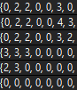

# 혼자힘으로 풀어보기
## 문제 분석
 0. 최대한 많은 코어에 전원을 연결하였을 경우, 전선의 길이의 최소값을 구해야한다. 먼저 최대한 많은 코어에 연결하는 모든 경우를 구해야한다. 코어수가, 길이보다 우선이다.

 1. 먼저 가장자리에 위치한 Core는 이미 전원이 연결된 것이므로 고려하지 않아도 된다. -> 대신, 가장자리에 위치한 Core는 다른 Core로 가는 선을 막을 수 있을 것이다.
 2. 전선은 교차해서는 안된다. : 
 3. 7 <= 가로,세로길이(N) <= 12 :
 4. 1 <= Core개수 <= 12 :
 5. 모든 core가 연결되지 않는 경우도 있다.

## 해결책 고민
모든 경우를 탐색하는 방법을 생각해보자. 어떤 하나의 코어는 왼쪽, 오른쪽, 위쪽, 아래쪽에서 선을 이어 전원을 연결할 수 있다. NxN에서 코어의 위치가 (i, j)라면 왼쪽은 : j, 오른쪽은 : N-j-1, 위쪽은 i, 아래쪽은 N-i-1의 전선 길이를 갖는다.

### 각 Cell의 상태 표현
 전선은 교차할 수 없는 등의 제한이 있으므로, 그 각 상태를 배열에 표현해야한다.
  - 0 : 빈 cell
  - 1 : core가 존재, 전원 연결되지 않은 상태.
  - 2 : 전원선이 해당 cell에 존재.
  - 3 : core가 전원이 연결됨.
  - 4 : 전원을 연결할 수 없는 코어.

### 탐색 정보를 저장할 방법?
 코어개수 k개를 연결했을 때, 길이가 l, l+1... 이라고 하면, 2차원 벡터에 v[k][0] = l, v[k][1] = l +1.. 이런식으로 저장할 수 있을 것이다. 

### 탐색하는 방법
 재귀적으로 구현하거나, 스택을 이용해 구현한다.

#### 재귀적 구현 
 각 방향에서 연결했을 때, cell_state를 그에 맞게 수정한다. 각 상태를 유지하고 함수를 호출한다.
 호출된 각 함수에서는 cell_state를 처음부터 탐색하며, 처음으로 연결 되지 않은 core를 탐색하여 역시 동일하게 각 방향 연결(state update) 후, 다음 함수를 호출한다.
 
 그리고 호출된 각 함수에서는 모든 core가 연결되었거나, 연결 불가능한 상태일때, 탐색 정보(연결된 코어개수, 전선의 길이)를 저장한다.
 
  탐색 도중의 정보는 저장할 필요가 없다.
 
 단지, 전역적으로 선언된 코어개수의 max 값과 그 때의 전선의 길이 min값을 최신화한다.

계획은 여기까지하고, 코드로 구현하면서 상세한 알고리즘을 생각해보기로 함.

# Code 분석
.. 귀찮으니 나중에


# Discussion
- 처음 내가 짠 코드를 돌렸을 때, 50개 중 31개가 맞았다고 떠서, 댓글에 찾아보았다. 내가 놓친부분은 상하좌우로 연결하는 경우만 생각하고, 해당 코어를 포함하지 않고, 그냥 pass하는 경우를 넣지 않았다는 것이다.. 이러한 직관이나 센스는 문제를 많이 풀면서 향상시킬 수 밖에 없을 것 같다..

- 위 처럼 그냥 pass하는 코드를 추가하였더니, 맞춘개수가 더 줄어들고, 시간초과가 떠버렸다... -> 남은 코어 수와 현재 최대 연결 코어 수를 이용해서, 연산을 줄여 시간초과는 피했다.

- 시간이 오래걸린 부분 : 어려운 것은 아니었지만, 행렬 index 계산을 잘못해서 쓸데없이 디버깅하는 시간이 오래걸렸다...


- 변수 전역 선언 vs 함수 내 선언(인자로 전달)
함수인자로 전달하는 경우는, 탐색 각 과정에 해당하는 변수값이 필요한 경우, 전역 선언보다 처리가 유리하고,
이 문제에서 나는 시간 초과를 피하기위해서, 남은 코어 수를 계산해야했는데.. 남은 코어 수는 계산과정에 호출된 각 함수에서마다 값이 다르므로, 인자로 전달하는 것이 맞다.


# 문제 오류..?
댓글을 보니, 답이 아닌데도 맞는것으로 채점된다고 한다. 
예를 들면 아래 예시에서 정답은, 최대 코어 연결갯수는 7개이고, 최소 전선길이는 8이지만.. 전선길이 10을 출력하는 코드가 정답이라고 채점된다고한다.
``` C++
1
7
0 0 0 0 0 1 0
0 0 0 0 0 1 1
0 0 0 0 0 1 0
1 1 1 0 0 0 0
0 1 0 0 0 0 0
0 0 0 0 0 0 0
0 0 0 0 0 0 0
```

  
내 코드 결과

그냥, 문제 오류인걸로..