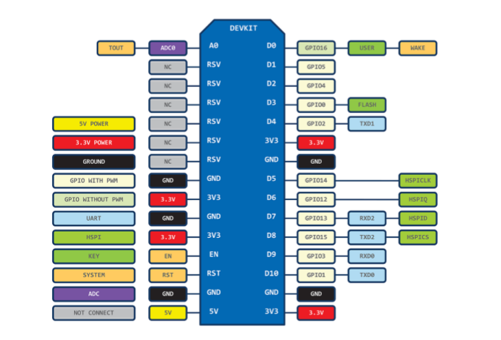

# NodeMCU
## Specification


### 와이파이 모듈
 와이파이 기능이 구현된 MCU 개발보드이다. ESP8266 와이파이모듈을 사용하고 있다. 802.11 b/g/n 표준을 지원한다.

### CP2012 칩셋
 USB 신호를 UART 신호로 변경하기 위해 CP2012 칩셋을 사용하고 있다.

### LM1117
 5V 전압을 3.3V로 변환하기위해 사용되는 부품이다.

## WiFi 연결
``` C
#include <ESP8266WiFi.h> // 와이파이 헤더파일

const char *ssid = "SSID"; 
const char *password = ""; 


void WiFiEvent(WiFiEvent_t event) {
    Serial.printf("[WiFi-event] event: %d\n", event);

    switch(event) {
        case WIFI_EVENT_STAMODE_GOT_IP:
            Serial.println("WiFi connected");
            Serial.println("IP address: ");
            Serial.println(WiFi.localIP());
            break;
        case WIFI_EVENT_STAMODE_DISCONNECTED:
            Serial.println("WiFi lost connection");
            break;
    }
}

void setup() {
    Serial.begin(115200); // Serial 통신 Speed를 설정과 동일하게 해줘야한다.

    WiFi.disconnect(true); // 현재 네트워크 연결을 끊는다.

    delay(1000);

    WiFi.onEvent(WiFiEvent); // onEvent 함수는 이벤트가 발생했을 때 호출할 함수를 지정한다.

    WiFi.begin(ssid, password);

    Serial.println();
    Serial.println();
    Serial.println("... ");
}


void loop() {
    delay(1000);
}
```
