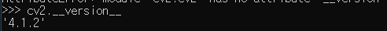
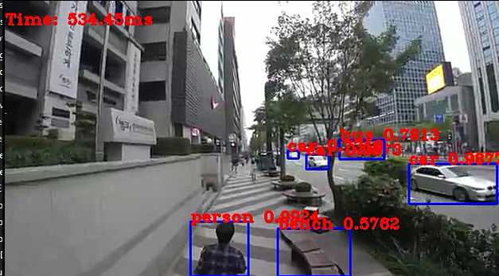

# OpenCV
 OpenCV는 오픈 소스 영상 처리 라이브러리이다.

# OpenCV설치
 파이썬에서는 pip를 이용해 쉽게 설치할 수 있다.
 ```
 pip install opencv-python
 ```

## 버전확인
``` python
import cv2
cv2.__version__
```

opencv 버전확인

# 내장 카메라에서 얼굴인식
먼저 `haarcascade_frontalface_default.xml` 파일을 소스코드와 같은 폴더에 넣어야한다.

``` python
import numpy as np
import cv2
 
detector = cv2.CascadeClassifier('haarcascade_frontalface_default.xml')
cap = cv2.VideoCapture(0) 
 
while (True):
    ret, img = cap.read()
    gray = cv2.cvtColor(img, cv2.COLOR_BGR2GRAY)
    faces = detector.detectMultiScale(gray, 1.3, 5)
    for (x, y, w, h) in faces:
        cv2.rectangle(img, (x, y), (x + w, y + h), (255, 0, 0), 2)
 
    cv2.imshow('frame', img)
    if cv2.waitKey(1) & 0xFF == ord('q'):
        break
 
cap.release()
cv2.destroyAllWindows()
```
코드 출처 : https://diy-project.tistory.com/79?category=727058


# YOLO


영상에 나오는 사람, 버스, 자동차, 벤치 등을 동시에 잘 구분한다.

영상출처 : 유튜브 (https://www.youtube.com/watch?v=U5Cp_Aq3teA)